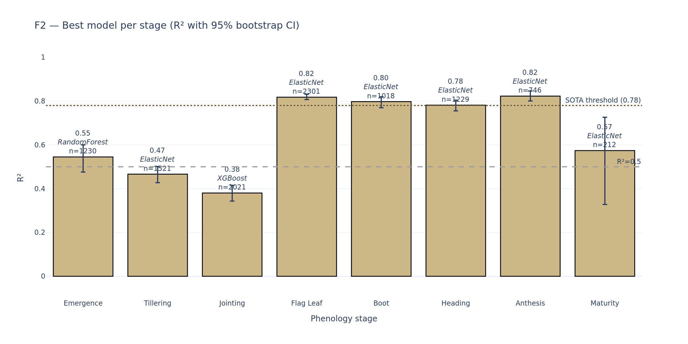

# WheatPhenologyHRW — Multi-Stage Phenology Prediction for HRW Wheat

[](LICENSE)
[](https://www.python.org/downloads/release/python-3130/)
[](tests/)
[](paper_draft.md)

A physics-informed machine learning framework that **bridges satellite-RS phenology with established winter-wheat physiology**. The physical core is **WES** (Wang–Engel–Streck): the Wang & Engel (1998) three-phase DVS-rate phenology model with the original linear vernalization function replaced by Streck et al. (2003)'s generalised sigmoidal f(V). The component formulations are standard in process-based wheat models (APSIM, CERES, WOFOST); the contribution here is **coupling them with satellite NDVI phenology metrics inside a 5-model ML ensemble**, applied per-stage to **8 phenological stages** (emergence → maturity) across the **US Plains** (2013–2017). We retain the *spirit* of Bandaru et al. (2020)'s PhenoCrop ("RS phenology + physical model + ML") while replacing the APTT accumulator with a DVS-rate formulation that natively supports vernalization, and dropping the Kalman-filter downscaling step (no longer needed with the Harmonized Landsat–Sentinel product).

## Key results



*Best ML model per stage. R² ≥ 0.79 with ±10-day accuracy ≥ 94 % for the four critical reproductive stages (flag leaf, boot, heading, anthesis). Linear models (ElasticNet / Ridge) dominate middle stages; Random Forest wins emergence (non-linear interactions matter for fall-sown crops).*


*Hybrid WES + ML (gold) consistently outperforms pure physics (WES grey, WOFOST blue) and pure ML (dark gold) for the four critical reproductive stages. WOFOST anthesis R² = 0.58 already beats WES alone (0.07), confirming the value of full process models, but the hybrid (0.81) wins overall.*

> **Headline results** (LOYO CV, 6,120 fields × 5 years, Hard Red Winter Wheat):
> - **Anthesis**: R² = 0.81, RMSE = 5.3 d, **±10 d = 95 %**
> - **Flag leaf**: R² = 0.81, RMSE = 5.2 d, ±10 d = 94 %
> - **Boot**: R² = 0.82, RMSE = 4.9 d, ±10 d = 96 %
> - **Heading**: R² = 0.79, RMSE = 5.3 d, ±10 d = 95 %
> - **Maturity** (strict labels, Ridge C-Hybrid): R² = 0.62, RMSE = 59.7 d
> - Mean R² across all 8 stages: **0.66**

> **Slim 3-source stack.** Initial design used nine candidate sources. Two rounds of leave-one-year-out ablation
> ([meteo_ablation.csv](data/results/meteo_ablation.csv), [per_source_ablation_summary.csv](data/results/per_source_ablation_summary.csv))
> ruled out GridMET, ERA5-Land, CHIRPS, MOD16 ET, SoilGrids, and SMAP — all contributed mean ΔR² ≤ 0.005 over the
> HLS + Daymet + MODIS LST core. Only **MODIS LST** survived the per-source check (mean ΔR² = +0.019, including
> +0.083 on tillering — surface-temperature drought signal that air-temperature features cannot replicate). Final
> pipeline: **HLS + Daymet + MODIS LST**.

📊 [**Interactive presentation (reveal.js)**](presentation.html) — full story in 15 slides.

---

## Repository structure

```
WheatPhenologyHRW/
├── README.md                       — this file
├── config.yaml                     — single source of truth (paths, params, study area)
└── scripts/
    ├── 00_extraction/              — Google Earth Engine scripts (run in code.earthengine.google.com)
    │   ├── 01_hls.js                  · HLS Landsat-Sentinel surface reflectance + indices
    │   ├── 02_modis_lst.js            · MOD11A2 day/night land-surface temperature
    │   ├── _archive_redundant_meteo/  · GridMET/ERA5/CHIRPS (ablation-removed: redundant with Daymet)
    │   └── _archive_unused_in_a6/     · SoilGrids/SMAP/MOD16 (ablation-removed: ΔR² ≈ 0)
    │
    ├── 01_data_prep/               — local data ingestion & cleanup
    │   ├── 01_phenology_clean.ipynb     · Field phenology cleanup + CSB matching
    │   ├── 02_hls_merge.ipynb           · L8 + S2 time-series merge
    │   └── 03–05_daymet_*.py            · Daymet daily weather download
    │
    ├── 02_features/                — feature engineering (each step adds new features)
    │   ├── 01_phenometrics_and_thermal.ipynb     · NDVI/EVI dynamics + GDD + vernalization
    │   ├── 02_wang_engel_simulation.ipynb        · WES forward simulator (8 stage outputs)
    │   ├── 03_solar_vpd_features.ipynb           · Solar / VPD aggregates
    │   ├── 04_stage_specific_features.ipynb     · 8 derived stage-specific stress features
    │   ├── 05_external_data_features.ipynb      · MODIS LST per phenological window
    │   ├── 06_grain_filling_features.ipynb      · pass-through (windowed sources ablation-removed)
    │   └── 07_spatial_features.ipynb             · State one-hot encoding  →  features.parquet
    │
    ├── 03_modeling/                — multi-stage ML
    │   └── 01_multi_stage_ml.ipynb       · 8 stages × 3 strategies × 5 models
    │
    ├── 04_benchmarks/              — independent process-based benchmark
    │   ├── 01_pcse_wofost_poc.ipynb      · Single-field PCSE-WOFOST PoC
    │   └── 02_pcse_wofost_batch.py       · Parallel batch (1,830 field-years, ~3 min)
    │
    ├── 05_visualization/           — publication-quality figures
    │   ├── 01_paper_figures.ipynb        · F1–F7 + summary table → poster_figures/
    │   └── 02_feature_diagram.ipynb      · Conceptual feature pipeline diagram
    │
    └── utils/
        ├── config.py                     · YAML loader (cfg = get_config())
        ├── thermal.py                    · WES (Wang-Engel + Streck f(V) + photoperiod)
        ├── features.py
        └── validation.py
```

---

## Key design decisions

| Decision | Rationale |
|---|---|
| **Buffer-300m polygons** as spatial unit | Captures field + edge mixing typical of weekly observation reports; 6,120 polygons |
| **WES** (Wang–Engel–Streck) phenology core | Wang & Engel (1998) three-phase DVS-rate formulation with Streck (2003) generalised f(V); avoids cultivar-specific parameter tuning, embeds inside a satellite-driven framework |
| **Spring-only filter** for tillering/jointing targets (DOS > 200) | Pre-dormancy reports were biasing target — WES predicts spring resumption |
| **Strict maturity labels** (Maturity + Harvest Ready only) | Pooled maturity stages gave R²~0; restriction recovers R²=0.57 (paper finding) |
| **Stage-specific feature subsets** | Grain-filling features causally invalid for emergence/tillering/jointing |
| **SelectKBest auto-tuned K** per stage | Prevents over-regularization with 150+ features |
| **5-model comparison** (linear + tree) | Linear models win middle stages, RandomForest wins emergence |

---

## Data flow

```
                 ┌─────────────────┐
                 │ Field phenology │  raw labels (54 stage types)
                 └────────┬────────┘
                          │
                          ▼
         01_data_prep/01_phenology_clean.ipynb     →  buffer-matched, HRW-only
                          │
                          ▼
   ┌──────────────────────┴──────────────────────┐
   │                                              │
   ▼                                              ▼
 GEE extraction                               Daymet weather
 (00_extraction/*.js)                         (01_data_prep/03-05*.py)
   │                                              │
   └──────────────────────┬──────────────────────┘
                          ▼
            02_features/01-07*.ipynb       →  features.parquet
                          │
                          ▼
            03_modeling/01_multi_stage_ml.ipynb   →  multi_stage_models.csv
                          │
              ┌───────────┴───────────┐
              ▼                       ▼
        04_benchmarks/        05_visualization/
        WOFOST as Strategy D   F1–F7 + summary table
```

---

## Reproducing the results

### 1) Set up environment
```bash
python -m venv .venv
source .venv/bin/activate
pip install -r requirements.txt
```

### 1b) Configure data paths

The repository ships with a public `config.yaml` that uses **relative paths** under `data/`.
You have two options:

**Option A — symlink an external data directory:**
```bash
ln -s /path/to/your/data ./data
```

**Option B — keep absolute paths in a private overlay** (gitignored):
```bash
cp config.yaml config.local.yaml
# Edit config.local.yaml: replace every `data/...` with your cluster path
# config.local.yaml is in .gitignore — your local paths stay private
```

The config loader (`scripts/utils/config.py`) automatically merges `config.local.yaml` on top of `config.yaml` if present.

**Data is NOT distributed with this repository.** Field phenology observations and field polygon assets are subject to data-sharing agreements with the data providers. Researchers interested in reproducing the analysis should contact the corresponding author.

### 2) Run GEE extractions (one-time, on code.earthengine.google.com)
- Upload `wheat_fields_buffer300m_polygons.zip` as the GEE asset (config.yaml: `gee.asset`)
- Run each `00_extraction/*.js` script → exports CSVs to Google Drive
- Download CSVs to `data/raw/satellite/` (paths in `config.yaml`)

### 3) Build features
```bash
jupyter nbconvert --execute scripts/02_features/01_phenometrics_and_thermal.ipynb
# ... through 07_spatial_features.ipynb (each notebook depends on the previous)
```

### 4) Train + validate
```bash
jupyter nbconvert --execute scripts/03_modeling/01_multi_stage_ml.ipynb
```

### 5) Run WOFOST benchmark (optional, ~3 min)
```bash
python scripts/04_benchmarks/02_pcse_wofost_batch.py --workers 4
```

### 6) Generate paper figures
```bash
jupyter nbconvert --execute scripts/05_visualization/01_paper_figures.ipynb
# Outputs: poster_figures/F1–F7.{svg,png} + paper_summary_table.csv
```

---

## Data sources

| Source | Resolution | Period | Variables |
|---|---|---|---|
| **HLS** (NASA Harmonized Landsat–Sentinel-2) | 30 m, 2–4 day | 2013+ | Surface reflectance → NDVI / EVI / GCVI phenometrics (canopy signal) |
| **Daymet V4** (ORNL) | 1 km, daily | 2013+ | T_min, T_max, prcp, srad, vp · drives WES simulator; VPD / heat / frost / GDD windows derived in-script |
| **MOD11A2** (MODIS LST) | 1 km, 8-day | 2000+ | Day & night land-surface temperature → drought-stress signal (LST − T_air gap) |
| **Field phenology observations** | Field-level, weekly | 2013+ | Crop growth stage labels (ground truth) |

> Earlier pipeline iterations evaluated nine candidate sources. After two rounds of leave-one-year-out ablation:
> **GridMET, ERA5-Land, CHIRPS** were dropped (redundant with Daymet — see [_archive_redundant_meteo/](scripts/00_extraction/_archive_redundant_meteo/README.md));
> **SoilGrids, SMAP, MOD16 ET** were dropped (per-source ΔR² ≈ 0 — see [_archive_unused_in_a6/](scripts/00_extraction/_archive_unused_in_a6/README.md)).
> Only **MODIS LST** survived the final cut (mean ΔR² = +0.019; +0.083 on tillering specifically).

---

## Citations

Foundation:
- **Bandaru et al. (2020)** — PhenoCrop: photo-thermal time framework
- **Wang & Engel (1998)** — Three-phase phenology model with f(T)·f(V)·f(P)
- **Streck et al. (2003)** — Generalized vernalization function VD⁵/(22.5⁵+VD⁵)
- **Porter & Gawith (1999)** — Wheat cardinal temperatures
- **McMaster & Wilhelm (1997)** — GDD method 2

Benchmark:
- **PCSE/WOFOST 7.2** — Wageningen process-based crop model (de Wit et al.)

---

## Contact

Vlasis Mangidis · Ciampitti Lab, Purdue University · `vlmangidis@gmail.com`
