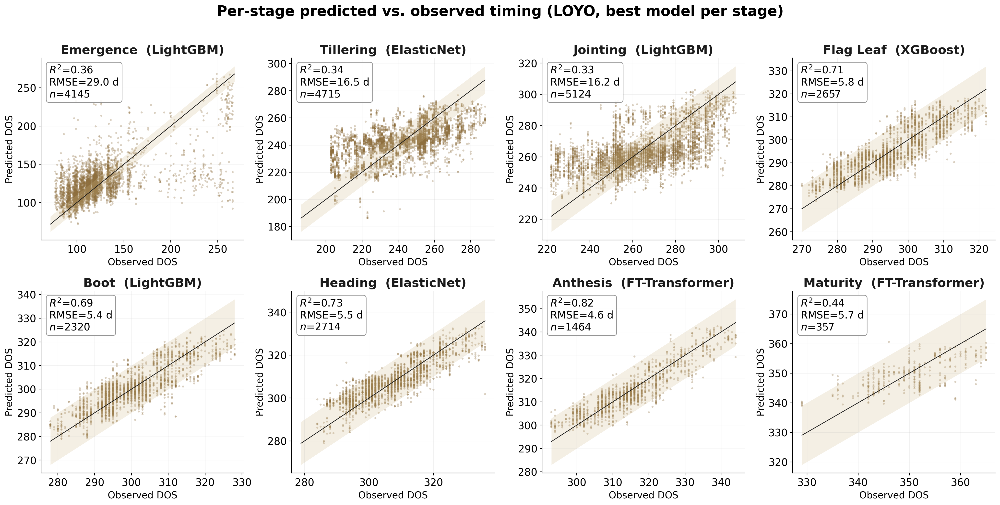

# WheatPhenologyHRW — Multi-Stage Phenology Prediction for HRW Wheat

[](LICENSE)
[](https://www.python.org/downloads/)
[](tests/)

A physics-informed machine-learning framework that **bridges satellite
remote-sensing phenology with established winter-wheat physiology**. The
physical core is **WES** (Wang–Engel–Streck): the Wang & Engel (1998)
three-phase DVS-rate phenology model with the original linear
vernalization term replaced by Streck et al. (2003)'s generalised
sigmoidal *f(V)*, anchored to **per-field observed sowing dates** rather
than a regional crop calendar. WES outputs are coupled with Harmonized
Landsat–Sentinel (HLS) phenometrics, Daymet meteorology and MODIS LST
inside a seven-model ML ensemble, applied per stage to the **eight
phenological stages** (emergence → maturity) of the **U.S. Hard Red
Winter belt**, over the four training seasons **2013/14–2016/17**.

## Key results



*Best model per stage under leave-one-year-out (LOYO) cross-validation.*

> **Headline** (LOYO CV; 5,293 fields; 8,465 field-years; four seasons
> 2013/14–2016/17; Hard Red Winter wheat):
> - **Anthesis** (FT-Transformer): R² = 0.82, RMSE = 4.6 d
> - **Heading**: R² = 0.73, RMSE = 5.5 d
> - **Flag leaf**: R² = 0.71, RMSE = 5.8 d
> - **Boot**: R² = 0.69, RMSE = 5.4 d
> - **Emergence**: R² = 0.36, RMSE = 29.0 d
> - **Tillering**: R² = 0.34, RMSE = 16.5 d · **Jointing**: R² = 0.33, RMSE = 16.2 d
> - **Maturity** (FT-Transformer; plausibility-filtered, DOS ≥ 280): R² = 0.44, RMSE = 5.7 d, n = 357
>
> The physiology-informed strategy (WES + ML) gives the higher LOYO R²
> in five of the eight stages (best model per strategy); a controlled,
> model-agnostic with/without-WES ablation confirms the physiological
> gain is robust at the reproductive transitions. Two deep tabular
> models (TabNet, FT-Transformer) are evaluated under the identical
> protocol; the FT-Transformer is the selected model at anthesis and
> maturity. Spatial transferability is assessed by leave-one-state-out
> (LOSO) CV, with a controlled LOSO ablation reported as a negative
> control (WES does not aid cross-region transfer).

## Repository structure

```
WheatPhenologyHRW/
├── README.md · LICENSE · CITATION.cff · requirements.txt
├── config.yaml                       — single source of truth (relative paths)
├── data_public/processed/            — DE-IDENTIFIED public data subset
│   ├── phenology_labels.parquet         · cleaned per-field stage observations
│   ├── sowing_lookup.parquet            · per field-year WES sowing anchor
│   ├── features_v3_train.parquet        · DOS-anchored model feature matrix
│   └── field_id_mapping.json            · anonymous-id count (originals omitted)
├── docs/figures/                     — manuscript figures (F1–F6, FA1, F2)
├── scripts/
│   ├── 00_extraction/                — Google Earth Engine extraction (.js)
│   │   ├── 01_hls.js                    · HLS L8+S2 surface reflectance
│   │   └── 02_modis_lst.js              · MOD11A2 land-surface temperature
│   ├── 01_sowing/
│   │   └── 01_build_sowing_lookup.py    · per field-year sowing anchor
│   ├── 02_features/
│   │   ├── 01_build_training_cohort.py  · enumerate the training field-years
│   │   └── 02_build_features.py         · DOS-anchored feature matrix (canonical)
│   ├── 03_modeling/
│   │   ├── 01_phase_e_loyo.py           · 8 stages × 2 strategies × 7 models, LOYO
│   │   └── 02_fix_maturity.py           · DOS ≥ 280 maturity-label correction
│   ├── 04_figures/
│   │   ├── 01_f1_study_area.py          · F1 study-area map
│   │   ├── 02_f2_framework.py           · F2 framework schematic
│   │   ├── 03_f3_scatter.py             · F3 per-stage predicted vs observed
│   │   ├── 04_f4_strategy.py            · F4 strategy comparison
│   │   ├── 05_f5_feature_importance.py  · F5 per-stage feature importance
│   │   ├── 06_f6_loso.py                · F6 LOSO transferability (5-model; superseded)
│   │   ├── 07_fa1_label_noise.py        · FA1 label-noise floor (runs on data_public/)
│   │   ├── 08_paper_figures.py          · consolidated figure driver (legacy)
│   │   └── 09_paper_figures.py          · canonical 7-model F3–F6 (FT-capable)
│   ├── 05_analysis/
│   │   ├── 01_sowing_sensitivity.py     · sowing-anchor perturbation (Supp. S4)
│   │   ├── 02_sowing_dev_recompute.py   · sowing-deviation calibration (Supp. S4)
│   │   ├── 03_reviewer_stats.py         · provenance for in-text numbers
│   │   ├── 04_tillering_target_ab.py    · tillering target-definition robustness (Supp. S7)
│   │   ├── 05_loso_wes_ablation.py      · WES cross-region negative control (Supp. S8)
│   │   ├── 06_anthesis_ft_ablation.py   · anthesis sowing-sensitivity, adopted FT
│   │   └── 07_seq_dl_baseline.py         · raw-signal TempCNN/LSTM baseline (Supp. S9)
│   ├── deidentify_public_release.py     · regenerates data_public/ from raw
│   └── utils/                           · config loader, WES thermal model, CV
└── tests/                            — smoke tests (config + import sanity)
```

## Data availability

Raw field phenology observations and field-polygon geometries are
subject to data-sharing agreements and are **not** redistributed. A
**de-identified subset** sufficient to reproduce the modelling and the
label-noise figure is committed under `data_public/processed/`: field
identifiers are remapped to anonymous integers (originals and exact
coordinates omitted), restricted to the four training seasons. Regenerate
it from the restricted source with:

```bash
python scripts/deidentify_public_release.py
```

## Reproducing the results

```bash
python -m venv .venv && source .venv/bin/activate
pip install -r requirements.txt
pytest -q tests/                                   # sanity

# Reproducible from the committed de-identified subset:
python scripts/04_figures/07_fa1_label_noise.py    # FA1 label-noise floor

# Full pipeline (needs the restricted raw data; configure paths via a
# gitignored config.local.yaml that overrides config.yaml):
python scripts/01_sowing/01_build_sowing_lookup.py
python scripts/02_features/01_build_training_cohort.py
python scripts/02_features/02_build_features.py
python scripts/03_modeling/01_phase_e_loyo.py     # 7-model Phase-E + LOSO (GPU)
python scripts/04_figures/09_paper_figures.py     # F3–F6 (GPU for deep stages)
python scripts/05_analysis/05_loso_wes_ablation.py    # Supp. S8 negative control
python scripts/05_analysis/06_anthesis_ft_ablation.py # adopted-FT anthesis ablation
python scripts/05_analysis/07_seq_dl_baseline.py      # Supp. S9 raw-signal TempCNN/LSTM
python scripts/02_features/02_build_features.py
python scripts/03_modeling/01_phase_e_loyo.py
python scripts/03_modeling/02_fix_maturity.py
python scripts/04_figures/08_paper_figures.py
```

`config.yaml` ships with **relative** paths under `data/`. Point the
pipeline at your own storage by creating a gitignored `config.local.yaml`
overlay (see `scripts/utils/config.py`); your local paths stay private.

## Data sources

| Source | Resolution | Variables |
|---|---|---|
| **HLS** (NASA Harmonized Landsat–Sentinel-2) | 30 m, 2–4 day | Surface reflectance → NDVI / EVI / GCVI phenometrics |
| **Daymet V4** (ORNL) | 1 km, daily | Tmin/Tmax/prcp/srad/vp → WES simulator + thermal/stress features |
| **MOD11A2** (MODIS LST) | 1 km, 8-day | Day/night land-surface temperature → drought-stress signal |
| **Field phenology observations** | Field-level, weekly | Growth-stage labels (ground truth; restricted) |

## Citations

- **Wang & Engel (1998)** — three-phase DVS-rate phenology model
- **Streck et al. (2003)** — generalised vernalization function *f(V)*
- **Porter & Gawith (1999)** — wheat cardinal temperatures
- **McMaster & Wilhelm (1997)** — growing-degree-day method
- **Bandaru et al. (2020)** — PhenoCrop photo-thermal framework

## Contact

Vlasis Mangidis · Ciampitti Lab, Purdue University · `vlmangidis@gmail.com`
